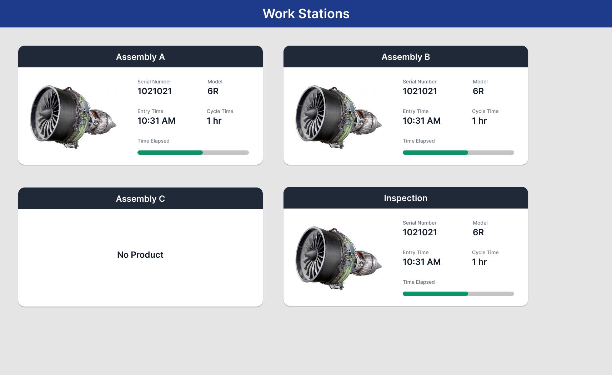

# Ubisense Take-Home exercise for Software Solutions Engineer 

Your task is to take the following design and build a functional version using a JavaScript framework of your choice (Vue.js, React etc.). We use Vue.js at Ubisense so that is strongly preferred if you have existing experience. 
There is no time limit for this exercise but ideally you shouldn't be spending more than a couple of hours on your solution. 


The application is a dashboard that displays the current status of work stations in an assembly line.



The live figma mockup for this design can be found [here](https://www.figma.com/file/X2F7lcU7AazcHxWc7OlPX4/Ubisense-Take-Home-Exercise?node-id=0%3A1).

Your application should fetch all of the data that it uses from the following simple API endpoints:
* `https://ubisense-takehome-api.netlify.app/.netlify/functions/engines` - returns of a list of engines including basic attributes such as id, model and image URL
* `https://ubisense-takehome-api.netlify.app/.netlify/functions/workstations` - returns a list of work stations including data about the cycle time and the current product (the id will match up with an engine from the engines endpoint)

You can quickly test out these APIs by visiting the URL in your web browser or using cURL:

```bash
❯ curl https://ubisense-takehome-api.netlify.app/.netlify/functions/engines
[
  {"id":"604676cf40ef9e9137f831e7","serialNumber":"121612129","model":"5R","image":"https://i.postimg.cc/MKbJTkrx/5R.jpg"},
  {"id":"60467703c7e7ca6bca3b598c","serialNumber":"342612171","model":"2R","image":"https://i.postimg.cc/RVzz4CdX/2R.jpg"},
  {"id":"6046770b70a8ffd3e95e7dc8","serialNumber":"9232842345","model":"8R","image":"https://i.postimg.cc/cLxytDV3/8R.png"},
  {"id":"604677132b5381c3d19a0dcc","serialNumber":"784213414","model":"5R","image":"https://i.postimg.cc/MKbJTkrx/5R.jpg"},
  {"id":"6046771b40c3fce9a6f8c11f","serialNumber":"4315112123","model":"2R","image":"https://i.postimg.cc/RVzz4CdX/2R.jpg"}
]
```

```bash
❯ curl https://ubisense-takehome-api.netlify.app/.netlify/functions/workstations
[
  {"name":"Assembly A","cycleTimeHrs":1.5,"currentProduct":{"id":"604676cf40ef9e9137f831e7","entryTime":1615229929818}},
  {"name":"Assembly B","cycleTimeHrs":1,"currentProduct":{"id":"604676cf40ef9e9137f831e7","entryTime":1615230589818}},
  {"name":"Assembly C","cycleTimeHrs":2,"currentProduct":null},
  {"name":"Inspection","cycleTimeHrs":0.5,"currentProduct":{"id":"604676cf40ef9e9137f831e7","entryTime":1615231489818}}
]
```

Your application only needs to fetch data from these APIs once (e.g. at startup) you don't need to refresh the data after that.

### Things to consider

- **Missing details in the mockups.** In our team a lot of the design details are left up to the developer. We need to be able to tackle basic design tasks without leaning on a separate designer. The mockups don't show you how to handle the case where the time elapsed has exceeded the cycle time so you will need to come up with a way to represent this.
- **Responsiveness.** Think about how your application is displayed on different sized screens. You don't need to create a completely separate mobile interface, but your design also shouldn't completely break at smaller screen sizes.

### Things you can ignore

- **Don't worry about old browsers.** You can use whatever modern features you like, like CSS Grid for example. We don't care if it's completely broken in IE 11.
- **You don't need to write tests.** If they help you then that's great, but don't prioritize them over getting the application implemented and functioning if they would slow you down.

### Submitting your solution

We would like to see both your source code and the finished application. You can do this however works best for you but some options to consider are:

- a link to a git repo and a running copy of the site deployed to a free static site host e.g GitHub pages or [Netlify](https://www.netlify.com/)
- a link to a [CodeSandbox](https://codesandbox.io/)
- the project files plus some simple instructions on how to run your application locally

In addition to source code please put together a short `README.md` file for your solution that talks about any interesting things that you ran into, decisions you made, etc. Think of it like a little postmortem just to talk through anything you found notable about the project. 
